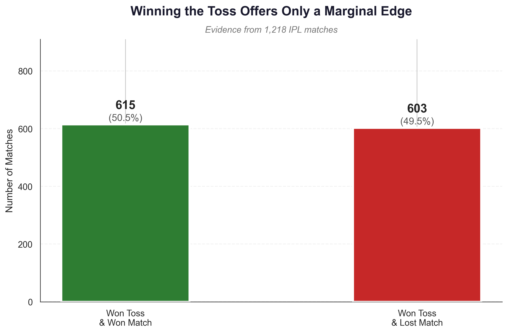
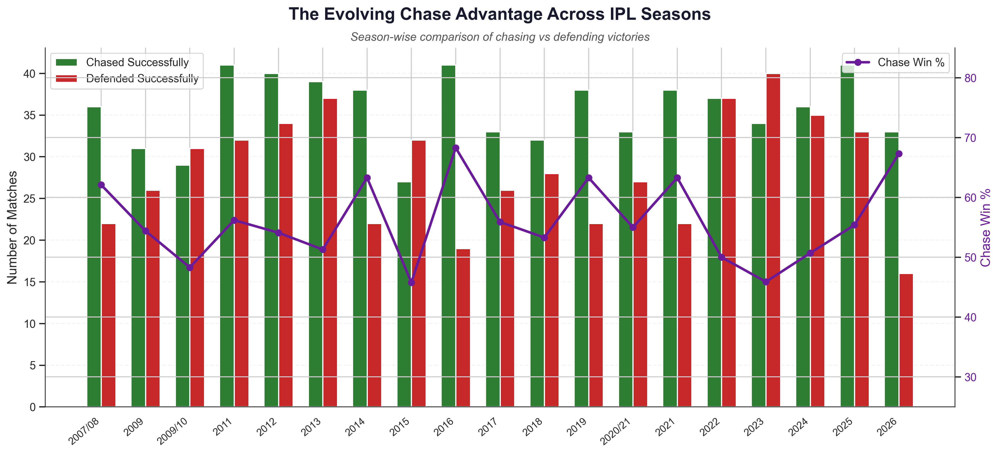
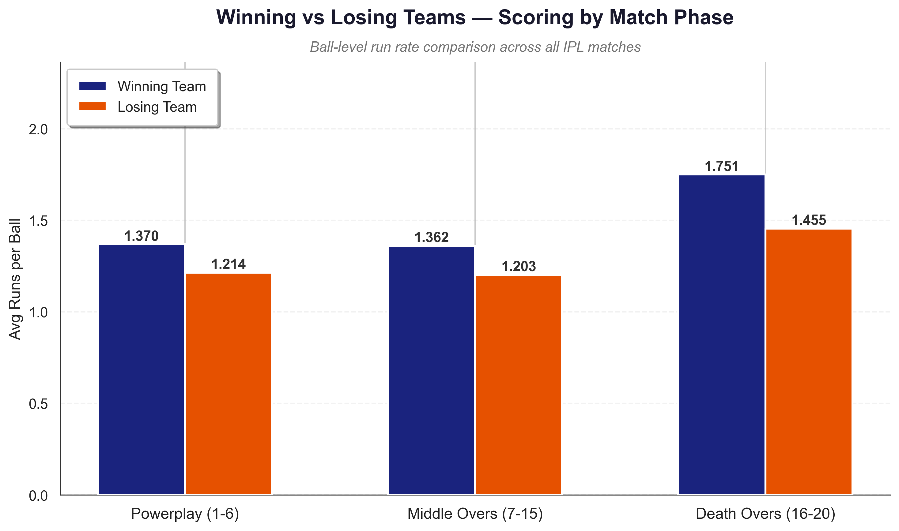
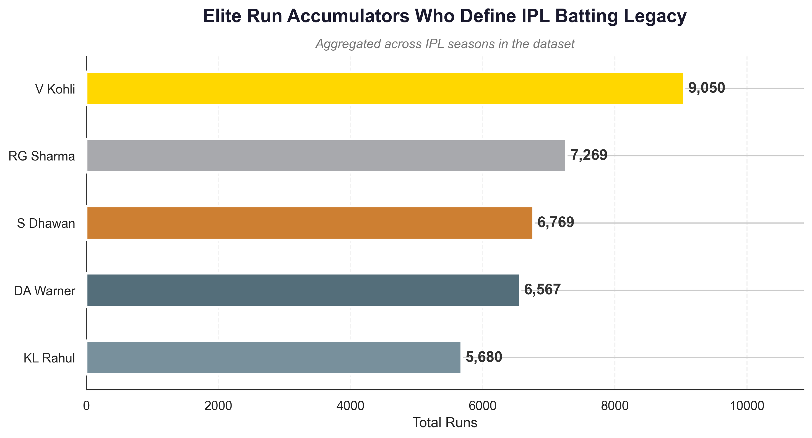
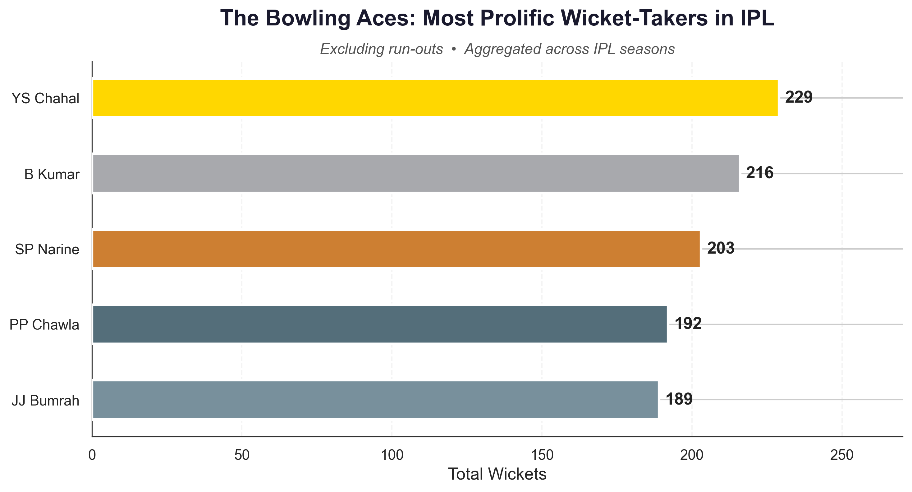

# 🏏 IPL Data Analytics
**A Deep Dive into T20 Match Dynamics, Phase Analysis, and Tactical Outcomes**


---

## 📈 Executive Snapshot

| Metric | Insight |
| :--- | :--- |
| **Matches Analyzed** | 1,218 |
| **Deliveries Processed** | 289,673 |
| **Toss Winner Win Rate** | ~50.5% |
| **Highest Impact Phase** | Death Overs (16–20) |
| **Aggregate Chase Win Rate** | Moderate Advantage (Fluctuating) |

## 💡 Why This Project Matters
In the high-variance environment of T20 cricket, conventional wisdom often overvalues singular events (like the toss) while undervaluing structured phase execution. By analyzing ball-by-ball granularity across multiple seasons, this project uncovers the tactical realities of the Indian Premier League. These insights shift the narrative from luck-based assumptions to execution-driven strategies, demonstrating how data can identify true competitive advantages.

## 🛠 Skills Demonstrated
- **Exploratory Data Analysis (EDA)**
- **Feature Engineering** (Phase modeling, outcome segmentation)
- **Data Visualization** (Matplotlib & Seaborn customization)
- **Statistical Interpretation**
- **Analytical Storytelling**
- **Sports Analytics Frameworks**

---

## 📂 Dataset & Workflow

This analysis utilizes a high-fidelity, multi-season dataset featuring ball-by-ball granularity.
- **Scope:** 1,218 matches and 289,673 individual deliveries.
- **Features Analyzed:** Ball-by-ball match states, toss decisions, run tallies, extras, wicket types, and venue data.

**Pipeline:**
`Data Cleaning` ➔ `Feature Engineering` ➔ `Exploratory Analysis` ➔ `Data Visualization` ➔ `Executive Insights`

---

## 📉 Visual Analytics Showcase

To optimize readability, the core analytical charts are grouped below. High-DPI versions are automatically exported to the `charts/` directory during execution.

### Tactical Outcomes

| Toss Impact Analysis | Chasing vs Defending Trends |
| :---: | :---: |
|  |  |
| *The toss provides negligible predictive value.* | *Chasing offers a variable but detectable edge.* |

### Match Phase & Player Consistency

| Match Phase Scoring | Top Performers (Bat & Bowl) |
| :---: | :---: |
|  | <br><br><br> |
| *Winning teams consistently dominate the Death Overs.* | *Elite rankings are achieved through sustained consistency.* |

---

## 🎯 Key Findings

- **The Toss Offers Limited Predictive Value:** Toss winners convert their advantage into victories roughly 50.5% of the time, highlighting that on-field execution dictates outcomes far more than pre-match probabilities.
- **Late-Innings Scoring Correlates with Success:** The largest scoring separation between winning and losing teams occurs during the Death Overs, pointing to late-innings acceleration as a key factor associated with victory.
- **Chasing Provides a Detectable Edge:** Teams batting second hold a moderate overall advantage, though this edge fluctuates significantly across seasons due to evolving pitch conditions and tactical shifts.

## ⚠️ Methodological Note
The findings presented in this analysis represent *statistical associations* and historical trends rather than definitive causal relationships. Conclusions drawn are descriptive and exploratory. Determining true causality (e.g., isolating the exact impact of winning the toss independent of team strength) would require advanced predictive modeling and causal inference techniques.

---

## 📁 Repository Structure

```text
IPL_CRUNCH_26/
├── charts/               # Exported high-DPI visualizations (.png)
├── data/                 # Raw datasets (e.g., ipl_matches.csv)
├── notebooks/            # Jupyter notebooks (ipl_analytics.ipynb)
├── README.md             # Project documentation
└── requirements.txt      # Python dependencies
```

## 🚀 How to Run

1. **Clone the repository**
   ```bash
   git clone https://github.com/mohanCIT/IPL-CRUNCH-26.git
   cd IPL_CRUNCH_26
   ```

2. **Install dependencies**
   ```bash
   pip install -r requirements.txt
   ```

3. **Launch the notebook**
   ```bash
   cd notebooks
   python -m jupyter notebook ipl_analytics.ipynb
   ```

## 🔮 Future Research Directions
Potential extensions to elevate this analysis further:
- **Predictive Modeling:** Developing machine learning models for real-time win probability estimation based on match phase contexts.
- **Venue-Adjusted Metrics:** Normalizing player statistics based on stadium dimensions and historical pitch archetypes.
- **Player Impact Modeling:** Calculating advanced "value over replacement player" metrics for specific T20 roles (e.g., death-over specialists).

---
*This repository serves as a professional sports analytics portfolio piece, demonstrating end-to-end data processing, strategic feature engineering, and executive-level data storytelling.*
